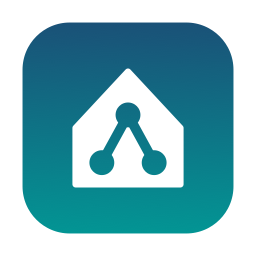

<p align="center">
  
</p>

# lanfirst

Send your internal web apps to the LAN reverse proxy when you can reach it, and let
them resolve over public DNS when you can't — automatically, no VPN toggling, no
editing `/etc/hosts`. macOS only.

```
on VPN / on LAN   →  *.example.com  →  192.168.1.10 (internal reverse proxy)
off VPN           →  *.example.com  →  public DNS → public endpoint
```

It decides per domain by **TCP health-checking** the internal target every few
seconds. Reachable → answer the internal IP; unreachable → forward to public DNS.

See [`CONTEXT.md`](./CONTEXT.md) for the glossary and
[`docs/adr/`](./docs/adr/) for why it's built this way.

## How it works

Three processes (see [ADR 0002](./docs/adr/0002-split-daemon-vs-single-app.md) and
[ADR 0003](./docs/adr/0003-privileged-resolver-sync-helper.md)):

- **`lanfirstd`** — always-on daemon (LaunchAgent, `KeepAlive=true`). A DNS resolver on
  `127.0.0.1:5354` plus the health-checker, and the sole writer of `config.yaml`. Keeps
  working even if you quit the menu bar.
- **`lanfirst`** — menu-bar app. A thin controller showing each domain's mode
  (🟢 LAN / ⚪ public), with **Add/Remove domain** dialogs and enable/disable/reload,
  talking to the daemon over a Unix socket.
- **`lanfirst-resolverd`** — small root LaunchDaemon. The only privileged piece: it watches
  `config.yaml` and reconciles `/etc/resolver/<domain>` so resolver files stay in sync with no
  recurring sudo.

macOS `/etc/resolver/<domain>` files route only those domains to the daemon; everything
else resolves normally.

## Menu bar states

The menu-bar icon is the lanfirst logomark — a house with a network inside — and it
tracks the daemon's routing state at a glance (all variants are generated by
[`assets/render-icons.swift`](./assets/render-icons.swift)):

| Icon | State | Meaning |
|:---:|---|---|
|  | **LAN** | At least one domain is routing to its internal target. |
|  | **Public** | No internal target reachable — everything resolves over public DNS. |
|  | **Off** | LAN routing disabled from the menu; all queries forwarded upstream. |
|  | **Error** | The menu-bar app can't reach the daemon. |

## Install

### Prebuilt release (recommended, Apple Silicon)

No Go toolchain needed:

```sh
curl -fsSL https://github.com/jarovkipt/lanfirst/releases/latest/download/lanfirst-macos-arm64.tar.gz | tar xz
cd lanfirst-v* && ./install.sh   # one sudo prompt; seeds a starter config if none exists
```

The installer sets up the user LaunchAgents (daemon + menu-bar app, auto-start at login) and one
root LaunchDaemon (`lanfirst-resolverd`), and seeds `~/.config/lanfirst/config.yaml` from the
example if you don't already have one. The single sudo prompt installs the privileged helper;
after that you manage domains from the menu bar with no further sudo.

### From source

Requires Go (`brew install go`).

```sh
git clone https://github.com/jarovkipt/lanfirst.git
cd lanfirst
bash install/install.sh        # builds the three binaries, then installs as above
```

## Updates

The menu-bar app checks GitHub Releases once a day (and has a manual
**Check for Updates…** item). When a newer release exists, an **Update to vX.Y.Z…** item
appears — click it, confirm, enter your admin password, and everything (daemon, app,
privileged helper) is replaced and restarted in place. Source builds ("dev builds") are
never nagged automatically, but the manual check offers to move you onto the release
channel. Releases are built by [`release.yml`](./.github/workflows/release.yml) whenever a
`v*` tag is pushed.

## ⚠️ Turn off Chrome "Secure DNS"

`/etc/resolver` only affects the macOS **system resolver**. Browsers using DoH bypass
it. In Chrome: `chrome://settings/security` → turn **Use secure DNS** off. Safari uses
the system resolver and needs no change. Firefox: disable DNS-over-HTTPS in Network
settings.

## Configure

Manage domains from the menu bar — no terminal, no sudo:

- **Add domain…** prompts for a match pattern (e.g. `*.corp.io`), the internal target IP, and a
  health-check port (default 443). The daemon writes it to `config.yaml` and `lanfirst-resolverd`
  syncs `/etc/resolver` automatically.
- Each domain's submenu has **Add exception…** and **Remove…** (Edit = remove + re-add for now).
- **Add exception…** carves a hostname out of a wildcard so it keeps using public DNS instead of
  the LAN target — e.g. route all of `*.corp.io` internally but leave `status.corp.io` public.
  Exceptions are exact (`status.corp.io`) or wildcard (`*.dev.corp.io`).

Behind the scenes this is still `~/.config/lanfirst/config.yaml`, which the daemon reloads on
save. The annotated [`config.example.yaml`](./config.example.yaml) documents every field; each
entry is:

```yaml
entries:
  - pattern: "*.example.com"   # wildcard = apex + all subdomains
    target: "192.168.1.10"      # internal reverse proxy
    port: 443                    # health-check port
    except:                      # optional: kept on public DNS
      - "public.example.com"
```

Different domains can point to different internal targets; each is health-checked
independently. **Note:** the daemon serialises the config via `yaml.Marshal`, so GUI edits do
not preserve hand-written comments in `config.yaml`.

## Verify

```sh
# Internal answer when on-VPN:
dig @127.0.0.1 -p 5354 app.example.com        # -> 192.168.1.10, ttl ~5

# Through the system resolver:
dscacheutil -q host -a name app.example.com

# Off-VPN, within ~5–10s the same query returns the public IP (forwarded upstream).

# Resolution survives quitting the menu-bar app (daemon keeps running):
launchctl list | grep lanfirst
```

## Troubleshooting

- **Domain won't resolve at all** — daemon down. Check `launchctl list | grep lanfirst`
  and `~/.config/lanfirst/daemon.log`.
- **Browser ignores it** — DoH still on (see above), or Chrome cached an old answer
  (`chrome://net-internals/#dns` → Clear host cache).
- **Off-VPN query hangs** — upstream misconfigured. With `upstream: []` lanfirst derives
  servers from `scutil --dns`; set explicit `upstream:` if your network has none.

## Uninstall

```sh
bash install/uninstall.sh   # leaves your config.yaml in place
```
